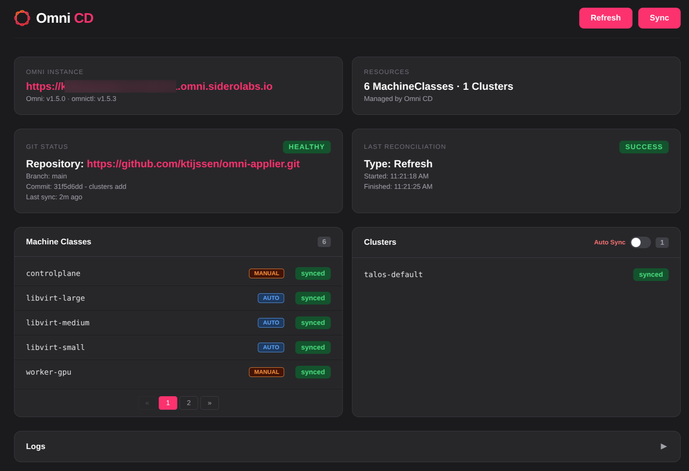

# Omni CD

A GitOps tool for [Sidero Omni](https://www.siderolabs.com/omni/). It watches a Git repository and continuously synchronises **MachineClasses** and **Cluster templates** to your Omni instance.



## Features

- **GitOps sync** — MachineClasses and Clusters are continuously reconciled from Git to Omni
- **Drift detection** — Detects out-of-sync resources without applying changes
- **Diff view** — Colour-coded diff between desired and live state per resource
- **Live cluster status** — `ready` and `apiserver` health badges per cluster
- **Multiple worker pools** — Cluster templates with multiple named worker groups are fully supported
- **Force sync** — Immediately sync a specific cluster from the web UI
- **Unmanaged clusters** — Clusters created outside of Git are visible and can be exported as templates
- **Version safety** — Sync is blocked when the Omni backend and bundled `omnictl` versions differ
- **Persistent state** — State is saved to disk and restored on restart
- **Real-time web UI** — WebSocket-driven dashboard; no page refreshes needed

---

## Installation

### Docker (recommended)

```bash
docker run -d \
  -e OMNI_ENDPOINT=https://your-omni.omni.siderolabs.io \
  -e OMNI_SERVICE_ACCOUNT_KEY=your-service-account-key \
  -e GIT_REPO=https://github.com/your-org/your-infra-repo.git \
  -v omni-cd-data:/data \
  -p 8080:8080 \
  ghcr.io/ktijssen/omni-cd:latest
```

### Docker Compose

```bash
cp deploy/compose/.env.example deploy/compose/.env
# Fill in your values, then:
cd deploy/compose && docker compose up -d
```

A full example with all variables is in [`deploy/compose/`](deploy/compose/).

### Binary

```bash
curl -LO https://github.com/ktijssen/omni-cd/releases/latest/download/omni-cd-linux-amd64
chmod +x omni-cd-linux-amd64
sudo mv omni-cd-linux-amd64 /usr/local/bin/omni-cd
```

`omnictl` must be in your `$PATH` when running the binary directly.

---

## Configuration

| Variable | Required | Default | Description |
|---|---|---|---|
| `OMNI_ENDPOINT` | Yes | — | Omni instance URL |
| `OMNI_SERVICE_ACCOUNT_KEY` | Yes | — | Omni service account key |
| `GIT_REPO` | Yes | — | Git repository URL |
| `GIT_BRANCH` | No | `main` | Branch to track |
| `GIT_TOKEN` | No | — | Token for private repositories |
| `MC_PATH` | No | `machine-classes` | Path to MachineClass YAMLs within the repo |
| `CLUSTERS_PATH` | No | `clusters` | Path to Cluster templates within the repo |
| `CLUSTERS_ENABLED` | No | `true` | Enable automatic cluster syncing on startup |
| `REFRESH_INTERVAL` | No | `300` | Seconds between git pull + drift checks |
| `SYNC_INTERVAL` | No | `3600` | Seconds between full reconciliations |
| `WEB_PORT` | No | `8080` | Web UI port |
| `LOG_LEVEL` | No | `INFO` | Log level: `DEBUG`, `INFO`, `WARN`, `ERROR` |

---

## Repository Structure

```
your-infra-repo/
├── machine-classes/
│   ├── controlplane.yaml
│   └── worker-general.yaml
└── clusters/
    ├── production/
    │   ├── cluster.yaml       ← only this file is processed
    │   └── patches/           ← other YAML files are ignored
    └── dev/
        └── cluster.yaml
```

- **MachineClasses** — every `.yaml` file in `MC_PATH` is applied
- **Clusters** — only files named `cluster.yaml` are processed (searched recursively)
- A `cluster.yaml` may contain multiple documents (`---`) including multiple named `Workers` sections

---

## How It Works

### Reconciliation Modes

| Mode | Trigger | What it does |
|---|---|---|
| **Refresh** | Every `REFRESH_INTERVAL` or via the Refresh button | Git pull + drift detection, no changes applied |
| **Sync** | Every `SYNC_INTERVAL` or via the Sync button | Full reconciliation — apply, update, and delete resources |

Resources are always processed in this order:

- **Apply:** MachineClasses → Clusters
- **Delete:** Clusters → MachineClasses

### Version Safety

If the Omni backend version is newer than the bundled `omnictl`, all sync operations are disabled and a warning appears in the UI. Pulling the latest image resolves this — each release is built against the latest `omnictl`.

### State Persistence

State is saved to `/data/omni-cd-state.json` after each reconcile and restored on startup, so the UI is immediately populated without waiting for the first cycle.

---

## Web Dashboard

### Main View (`/`)

Overview cards for Omni connectivity, Git status, and last reconciliation, followed by a MachineClasses table and a Clusters table. Clicking any resource opens a modal with **Error**, **Live**, and **Diff** tabs.

### Clusters View (`/clusters`)

A card grid showing one card per cluster with Talos/Kubernetes versions, controlplane node count, and worker pool details.

### Header Controls

| Control | Action |
|---|---|
| **Refresh** | Trigger a soft refresh (drift check, no changes) |
| **Sync** | Trigger a full sync |
| **Logs** | Open the live log viewer |

---

## API Endpoints

| Method | Path | Description |
|---|---|---|
| `GET` | `/` | Web UI — main dashboard |
| `GET` | `/clusters` | Web UI — clusters card grid |
| `GET` | `/ws` | WebSocket — real-time state updates |
| `GET` | `/api/state` | Current state as JSON |
| `POST` | `/api/reconcile` | Trigger a full sync |
| `POST` | `/api/check` | Trigger a git refresh |
| `POST` | `/api/clusters-toggle` | Toggle automatic cluster sync on/off |
| `POST` | `/api/force-cluster` | Force sync a specific cluster `{"id": "cluster-name"}` |
| `POST` | `/api/export-cluster` | Export an unmanaged cluster as YAML `{"id": "cluster-name"}` |

---

## Development

Requires Go 1.23+, [Task](https://taskfile.dev), Docker, and `omnictl` in your `$PATH`.

```bash
task dev            # Run locally with DEBUG logging
task build          # Build binary
task check          # Run fmt + vet
task docker:build   # Build Docker image
task compose:up     # Start via Docker Compose
task                # List all available tasks
```

---

## Releases

Images and binaries are published automatically to [GitHub Releases](https://github.com/ktijssen/omni-cd/releases) and GHCR on every push to `main` and whenever a new `omnictl` version is detected.

---

## Troubleshooting

**Version mismatch** — Pull the latest image; it is always built against the latest `omnictl` release.

**MachineClass not applying** — Check the **Error** tab in the resource modal for validation errors.

**Cluster stuck in Out of Sync** — Use the **Force Sync** button, then check the **Logs** viewer for the error.

**State lost after restart** — Ensure `/data` is backed by a persistent volume.

---

## License

Mozilla Public License Version 2.0 — see [LICENSE](LICENSE) for details.

## Contributing

Contributions are welcome. Please open an issue or submit a pull request.
