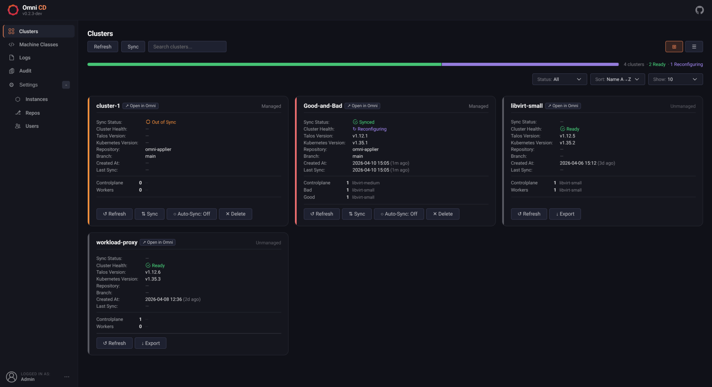
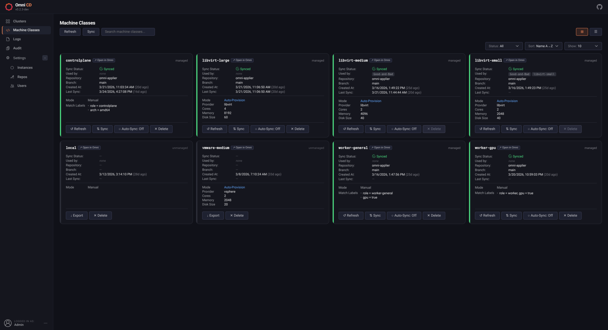
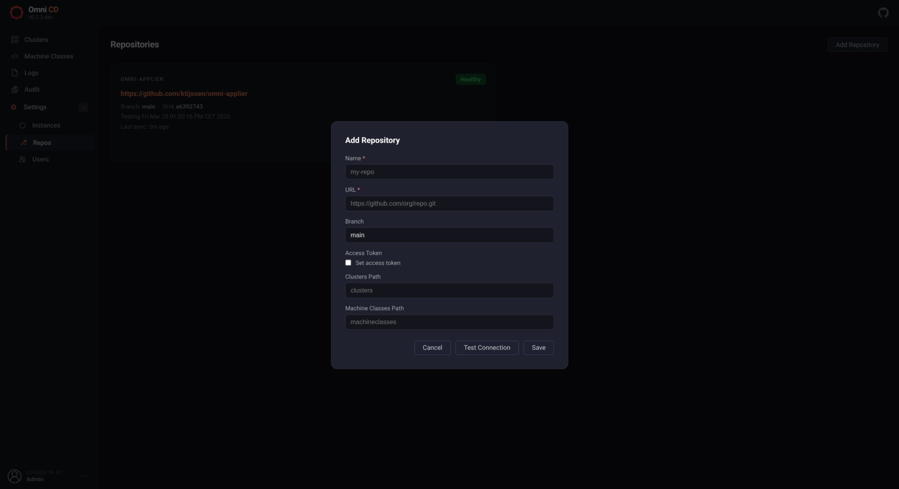

> [!IMPORTANT]
> This is an independent, community-built project and is **not** an official product of [Sidero Labs](https://www.siderolabs.com/). It is not affiliated with, endorsed by, or supported by Sidero Labs. Omni and Talos Linux are trademarks of Sidero Labs, Inc.

# Omni CD

A GitOps operator for [Sidero Omni](https://www.siderolabs.com/omni/) — continuously reconciles **MachineClasses** and **Clusters** from Git to your Omni instance.


<details>
<summary>Screenshots</summary>
<br>

| Clusters | Cluster Detail |
|---|---|
|  |  |

| Machine Classes | Repos |
|---|---|
|  |  |

</details>

---

## Quick Start

```bash
docker run -d \
  -v omni-cd-data:/data \
  -p 8080:8080 \
  ghcr.io/ktijssen/omni-cd:latest
```

Open `http://localhost:8080` — you will be redirected to `/setup` to create the admin account on first boot. The Omni endpoint and service account key can be configured there, declared in a YAML config file (mount with `--config-path=/config/config.yaml`), or supplied via environment variables. See [`deploy/config.example.yaml`](deploy/config.example.yaml) for the file schema.

→ For Docker Compose and Helm see [Installation](docs/installation.md).

---

## Features

- **GitOps sync** — MachineClasses and Clusters continuously reconciled from Git to Omni
- **Multi-repo** — Manage resources from multiple Git repositories in one instance
- **Drift detection** — Detects out-of-sync resources without applying changes; colour-coded diff view
- **Live cluster status** — Health badges for cluster, controlplane, API, etcd, and WireGuard
- **Kubernetes manifest status** — Per-cluster manifest sync status with group, mode, phase, and per-resource breakdown
- **Machine graph** — Visual DAG: Git → Omni → Cluster → MachineSets → Machines
- **Per-cluster auto-sync** — Enable or disable automatic sync per cluster from the UI
- **Unmanaged clusters** — Export externally-created clusters as YAML templates
- **Authentication** — Local login and OIDC/SSO; configurable roles, session management
- **Audit log** — Every user action recorded with actor, action, and resource; 30-day retention
- **Real-time UI** — WebSocket-driven dashboard; no page refreshes needed
- **Persistent state** — State and logs survive container restarts via volume mount
- **Prometheus metrics** — `/metrics` endpoint with cluster, MC, reconcile, and Omni health metrics; includes Grafana dashboard and ServiceMonitor
- **Helm chart** — Ingress, HTTPRoute (Gateway API), existing secrets, and Prometheus ServiceMonitor support

---

## Documentation

| | |
|---|---|
| [Installation](docs/installation.md) | Docker, Docker Compose, Helm, data layout |
| [Configuration](docs/configuration.md) | Environment variables, repository structure |
| [Authentication](docs/authentication.md) | Local login, OIDC/SSO, user roles |
| [Web UI](docs/web-ui.md) | Page-by-page reference with screenshots |
| [API Reference](docs/api.md) | All endpoints with roles and payloads |
| [Development](docs/development.md) | Task commands, troubleshooting, contributing |

---

## License

[Mozilla Public License 2.0](LICENSE)

---

## Contributing

Contributions are welcome. Please open an issue or submit a pull request on [GitHub](https://github.com/ktijssen/omni-cd).

---

## Feedback

Have a question, idea, or found a bug? I'd love to hear from you. You can find me in the **Sidero Labs Community Slack** — feel free to reach out there.

→ [Join the Sidero Labs Community Slack](https://inviter.co/sidero-labs-community)
