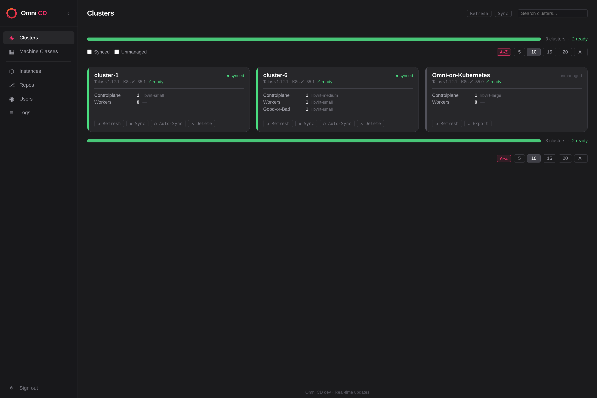
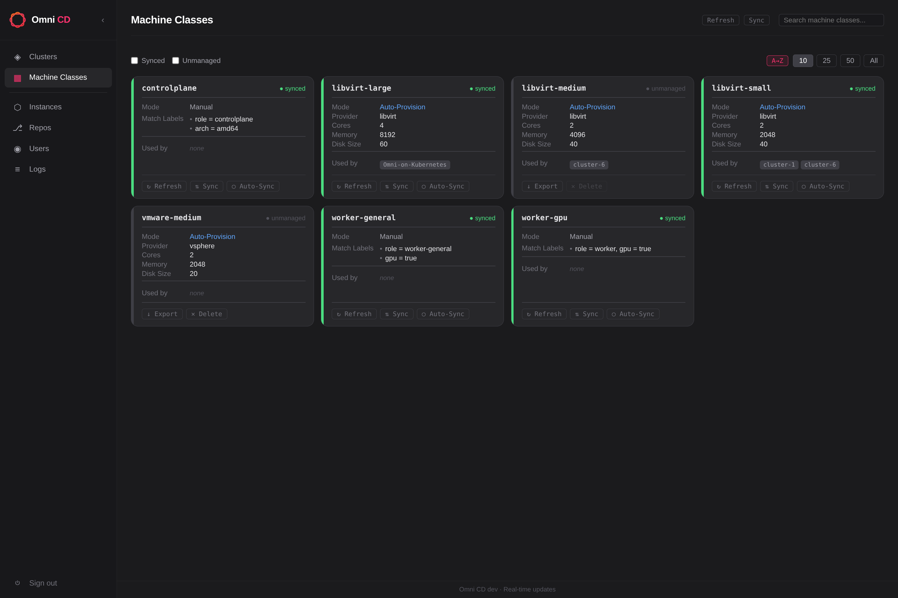
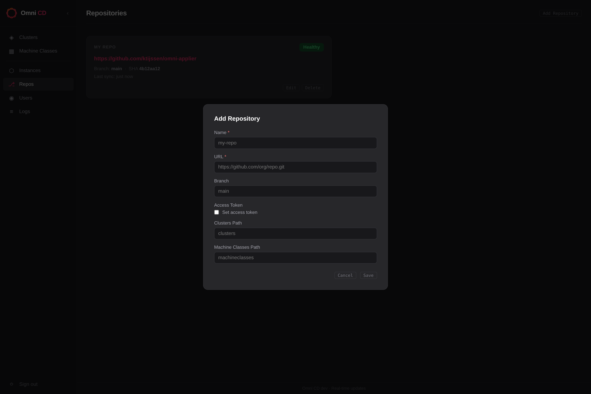
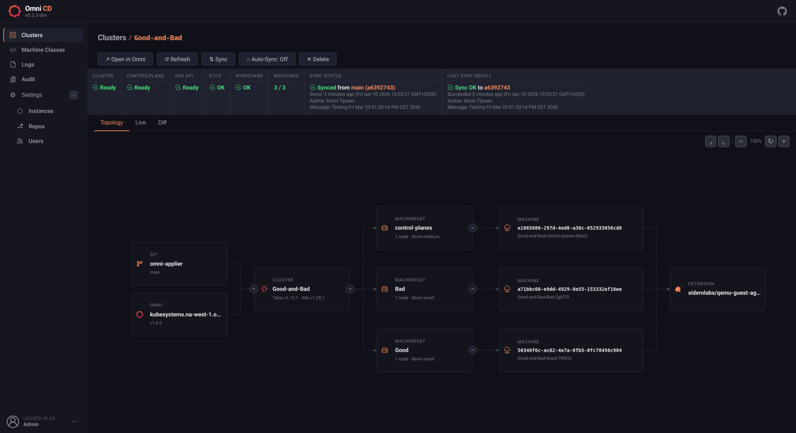

# Omni CD

A GitOps tool for [Sidero Omni](https://www.siderolabs.com/omni/). It watches one or more Git repositories and continuously reconciles **MachineClasses** and **Cluster templates** to your Omni instance.

<p>
  
  
</p>
<p>
  
  
</p>

---

## Features

- **GitOps sync** — MachineClasses and Clusters are continuously reconciled from Git to Omni
- **Multi-repo support** — Manage resources from multiple Git repositories in one instance
- **Drift detection** — Detects out-of-sync resources without applying changes
- **Diff view** — Colour-coded diff between desired and live state per resource
- **Live cluster status** — Cluster, controlplane, Kubernetes API, etcd, and WireGuard health badges
- **Machine graph** — Visual DAG showing Git → Omni → Cluster → MachineSets → Machines
- **Multiple worker pools** — Cluster templates with multiple named worker groups are fully supported
- **Per-cluster auto-sync** — Enable or disable automatic sync per cluster from the web UI
- **Unmanaged clusters** — Clusters created outside of Git are visible and can be exported as templates
- **Machine class usage** — Each MachineClass card lists which clusters are currently using it
- **Persistent state** — State is saved to disk and restored on restart
- **Authentication** — Email/password login with session cookies, first-time setup wizard, and user management (or fully disabled for internal use)
- **Real-time web UI** — WebSocket-driven dashboard; no page refreshes needed
- **Log persistence** — Logs are written to daily rotating files and survive container restarts
- **Omni instance management** — Omni endpoint and service account key can be configured via the web UI

---

## Installation

### Docker (recommended)

```bash
docker run -d \
  -v omni-cd-data:/data \
  -p 8080:8080 \
  ghcr.io/ktijssen/sidero-omni-cd:latest
```

The Omni endpoint and service account key can be set via environment variables **or** configured at runtime from the **Instances** page in the web UI.

### Docker Compose

```bash
cp deploy/compose/.env.example deploy/compose/.env
# Edit .env with your values
cd deploy/compose && docker compose up -d
```

A full example with all variables is in [`deploy/compose/`](deploy/compose/).

---

## Configuration

### Environment Variables

| Variable | Required | Default | Description |
|---|---|---|---|
| `OMNI_ENDPOINT` | No* | — | Omni instance URL |
| `OMNI_SERVICE_ACCOUNT_KEY` | No* | — | Omni service account key |
| `REFRESH_INTERVAL` | No | `300` | Seconds between git pull + drift checks |
| `ADMIN_USERNAME` | No | `admin` | ⚠️ **Deprecated** — Bootstrap email used on first boot with `ADMIN_PASSWORD`. Will be removed in the next release. Use the `/setup` wizard instead. |
| `ADMIN_PASSWORD` | No** | — | ⚠️ **Deprecated** — Bootstrap password applied on first boot only (ignored once a user exists). Will be removed in the next release. Use the `/setup` wizard instead. |
| `AUTH_DISABLED` | No | `false` | Set `true` to disable login entirely (hides Users page) |
| `WEB_PORT` | No | `8080` | Web UI port |
| `LOG_LEVEL` | No | `INFO` | Log level: `DEBUG`, `INFO`, `WARN`, `ERROR` |
| `LOG_RETENTION_DAYS` | No | `7` | Number of days to keep daily log files |

\* Can be configured via the **Instances** page in the web UI instead. If set via environment, the values are locked and cannot be changed from the UI.

\*\* `ADMIN_PASSWORD` and `ADMIN_USERNAME` are deprecated and will be removed in the next release. Use the **Setup** page (`/setup`) to create the initial account interactively.

---

## Repository Structure

```
your-infra-repo/
├── machine-classes/
│   ├── controlplane.yaml
│   └── worker-general.yaml
└── clusters/
    ├── production/
    │   └── cluster.yaml       ← only this filename is processed
    └── dev/
        └── cluster.yaml
```

- **MachineClasses** — every `.yaml` file directly in `mc_path` is applied
- **Clusters** — files named `cluster.yaml` are found recursively under `clusters_path`
- A `cluster.yaml` may contain multiple YAML documents (`---`) including multiple named `Workers` sections

---

## How It Works

### Reconciliation Modes

| Mode | Trigger | What it does |
|---|---|---|
| **Refresh** | Every `REFRESH_INTERVAL` seconds or the Refresh button | Git pull + drift detection, no changes applied |
| **Sync** | Sync button or per-cluster force sync | Full reconciliation — apply, update, and delete resources |

Resources are always processed in this order:

- **Apply:** MachineClasses → Clusters
- **Delete:** Clusters → MachineClasses

### Safety Guards

- Resources **not owned** by this Omni CD instance (created externally or by another instance) are never deleted
- Auto-sync can be disabled per cluster from the UI — out-of-sync clusters are shown but not applied
- Clusters from repos that fail to pull are protected from deletion during the outage window

### State Persistence

State is saved to `/data/state/state.json` after each reconcile and restored on startup, so the UI shows current state immediately without waiting for the first cycle.

---

## Web UI

The UI is a single-page app with a sidebar. Navigating to `/` redirects to `/clusters`.

### Clusters (`/clusters`)


Card grid showing one card per cluster with:
- Talos and Kubernetes versions
- Cluster, controlplane, API, etcd, and WireGuard health badges
- Controlplane and worker pool configuration
- Per-cluster Refresh, Sync, Auto-Sync toggle, and Delete actions

Click a card to open the cluster detail page with a **Graph** tab (visual DAG of the full stack), a **Live** tab (current Omni YAML), and a **Diff** tab (desired vs live).


Clusters created outside of Git (unmanaged) are shown with an **Export** button to download them as a YAML template.

### Machine Classes (`/machineclasses`)


Card grid showing each MachineClass with its provisioning mode, resource settings, machine limit, and a live **Used by** list showing which clusters reference it. Each card has Refresh, Sync, Auto-Sync toggle, and Delete actions. Click a cluster chip to jump to that cluster.

### Instances (`/instances`)

Manage the Omni endpoint and service account key. When credentials are provided via environment variables they are shown as read-only. When not set via ENV, use the **Add Omni Instance** button to configure the connection, or **Edit** / **Delete** an existing one. Changes take effect immediately.

### Repos (`/repos`)


Add, edit, and remove Git repositories at runtime without restarting. Supports optional per-repo authentication tokens. Default paths are `clusters/` and `machine-classes/` if not specified.

### Users (`/users`)

Manage the local user account. Shows the current user's display name and email. From here you can:

- **Edit Profile** — update your email address and display name
- **Change Password** — change your password (requires current password; enforces strength rules)

> This page is hidden and inaccessible when `AUTH_DISABLED=true`.

### Logs (`/logs`)

Reconciler log stream with filtering and export:

- **Level filter** — toggle INFO / WARN / ERROR (and DEBUG when `LOG_LEVEL=DEBUG`)
- **Component filter** — narrow logs to a specific component
- **Text search** — filter by message content
- **Download Today's Logs** — download the current day's log file as JSONL
- **Show Logs** — browse all stored daily log files with individual download buttons

Logs are written to daily rotating files under `/data/logs/` and are re-loaded into the ring buffer on restart so history is preserved across container restarts. Files older than `LOG_RETENTION_DAYS` days are automatically deleted.

---

## API

| Method | Path | Description |
|---|---|---|
| `GET` | `/ws` | WebSocket — real-time state updates |
| `GET` | `/api/state` | Current state as JSON |
| `POST` | `/api/reconcile` | Trigger a full sync |
| `POST` | `/api/check` | Trigger a git refresh (no apply) |
| `POST` | `/api/clusters-toggle` | Toggle global cluster sync on/off |
| `POST` | `/api/refresh-cluster` | Refresh a single cluster `{"id":"name"}` |
| `POST` | `/api/force-cluster` | Force sync a single cluster `{"id":"name"}` |
| `POST` | `/api/delete-cluster` | Delete a cluster `{"id":"name"}` |
| `POST` | `/api/set-cluster-autosync` | Set per-cluster auto-sync `{"id":"name","autoSync":true}` |
| `POST` | `/api/export-cluster` | Export an unmanaged cluster as YAML `{"id":"name"}` |
| `POST` | `/api/refresh-mc` | Refresh all machine classes (no apply) |
| `POST` | `/api/refresh-single-mc` | Refresh a single machine class `{"id":"name"}` |
| `POST` | `/api/sync-machineclass` | Force sync a single machine class `{"id":"name"}` |
| `POST` | `/api/delete-machineclass` | Delete a machine class `{"id":"name"}` |
| `POST` | `/api/set-mc-autosync` | Set per-machine-class auto-sync `{"id":"name","autoSync":true}` |
| `POST` | `/api/repos` | Add a git repository |
| `PUT` | `/api/repos` | Update a git repository |
| `DELETE` | `/api/repos` | Remove a git repository |
| `GET` | `/api/omni-instance` | Get current Omni instance config |
| `POST` | `/api/omni-instance` | Save Omni instance config |
| `POST` | `/api/omni-instance/test` | Test Omni connection |
| `DELETE` | `/api/omni-instance` | Remove stored Omni instance config |
| `GET` | `/api/logs/files` | List available daily log files |
| `GET` | `/api/logs/download?date=YYYY-MM-DD` | Download a specific day's log file |
| `GET` | `/api/users` | List users (email + display name, no hashes) |
| `POST` | `/api/users/change-password` | Change password `{"currentPassword":"…","newPassword":"…"}` |
| `POST` | `/api/users/update-profile` | Update email/display name `{"newEmail":"…","newDisplayName":"…"}` |

---

## Development

Requires Go 1.26+, [Task](https://taskfile.dev), and Docker.

```bash
# Development
task dev                     # Run locally with DEBUG logging
task build                   # Build binary (current OS/arch)
task build:linux             # Build static linux/amd64 binary
task install                 # go install

# Code quality
task fmt                     # go fmt
task vet                     # go vet
task lint                    # golangci-lint
task check                   # Run fmt + vet

# Dependencies
task deps                    # Download modules
task deps:tidy               # go mod tidy
task deps:update             # go get -u + tidy

# Docker
task docker:build            # Build Docker image
task docker:run              # Build + run container locally

# Docker Compose
task compose:up              # Start services
task compose:down            # Stop services
task compose:build           # Build and start services
task compose:rebuild         # Rebuild and restart
task compose:rebuild:nocache # Rebuild (no cache) and restart
task compose:logs            # Follow compose logs
task compose:restart         # Restart services

# Utilities
task clean                   # Remove build artifacts
task clean:docker            # Remove Docker image
task clean:all               # Clean everything
task open                    # Open web UI in browser
task version                 # Show Go and tool versions
task                         # List all available tasks
```

---

## Troubleshooting

**Cluster stuck in Out of Sync** — Click the Diff tab to see what changed, then use the Sync button or check the Logs page for the underlying error.

**MachineClass not applying** — Open the resource modal and check the Error tab for validation output.

**State lost after restart** — Ensure `/data` is backed by a persistent volume. State is stored in `/data/state/state.json`.

**Login not working** — If you set `ADMIN_PASSWORD` on first boot it creates the initial account. Once a user exists, `ADMIN_PASSWORD` is ignored — use the **Users** page to change the password, or set `AUTH_DISABLED=true` for passwordless access.

**Cannot connect to Omni** — Check the Instances page to verify the endpoint and key are configured. If set via ENV, ensure the variables are correct. The startup log shows which credential source is active.

---

## License

Mozilla Public License Version 2.0 — see [LICENSE](LICENSE) for details.

## Contributing

Contributions are welcome. Please open an issue or submit a pull request.
