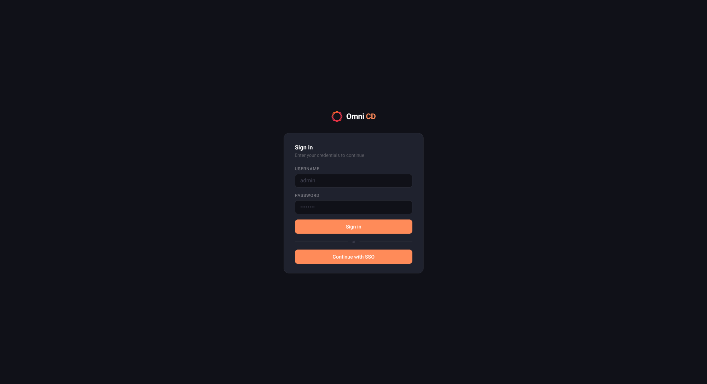

# Authentication

---

## First-time Setup

On first boot (no users configured), all requests redirect to `/setup`. Enter a password for the built-in `admin` account. The username is fixed as `admin`.

Alternatively, set `ADMIN_PASSWORD` to bootstrap the account non-interactively — useful for automated deployments. Once a user exists this variable is ignored.

---

## Local Login

Log in at `/login` with username `admin` and your password. Sessions last 24 hours and are restored across restarts.

**Rate limiting:** 5 failed attempts from the same IP triggers a 15-minute lockout.

To change the password or display name, go to **Users → Local Admin Account**.

---

## OIDC / Single Sign-On

Set `OIDC_ENABLED=true` with at minimum `OIDC_ISSUER_URL` and `OIDC_CLIENT_ID`. A **Sign in with SSO** button appears on the login page alongside the local login form.

### Role assignment

Roles are resolved in priority order:

1. `OIDC_ADMIN_EMAILS` — exact email match → `admin`
2. `OIDC_ADMIN_GROUPS` — group membership → `admin`
3. `OIDC_VIEWER_EMAILS` — exact email match → `viewer`
4. `OIDC_VIEWER_GROUPS` — group membership → `viewer`
5. `OIDC_DEFAULT_ROLE` — fallback (default: `viewer`)

The **first** OIDC user to log in is automatically promoted to `admin` regardless of rules.

### Groups claim

Auth0 and some providers do not include groups in the token by default. Either:
- Use email-based mapping (`OIDC_ADMIN_EMAILS`) — no provider-side config needed
- Configure your IdP to inject groups into the token, then set `OIDC_GROUPS_CLAIM` to the claim name

### Managing SSO users

SSO users appear in **Settings → Users → SSO Users**. Admins can change each user's role (`admin`, `viewer`, or `none`) or remove them. Removing a user immediately invalidates their active sessions.

---

## Disabling Authentication

Set `AUTH_DISABLED=true` to bypass login entirely. The Users page is hidden and all sessions are treated as admin. Intended for internal/trusted deployments only.
