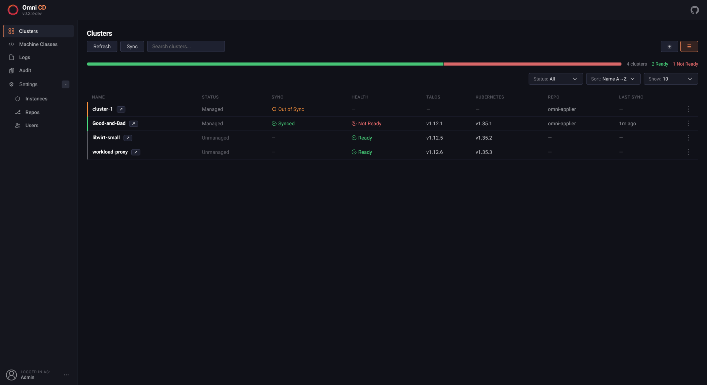
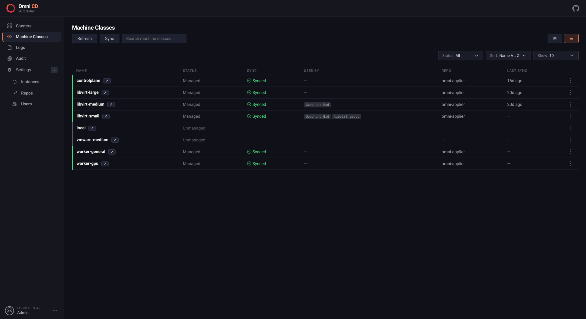
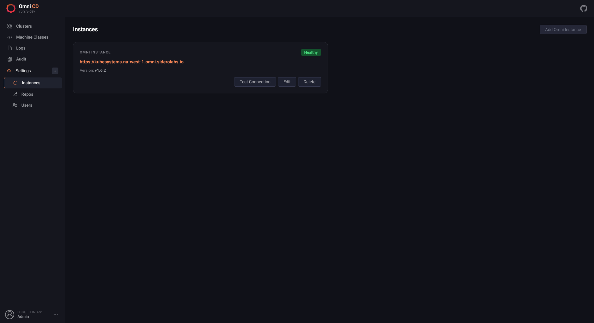
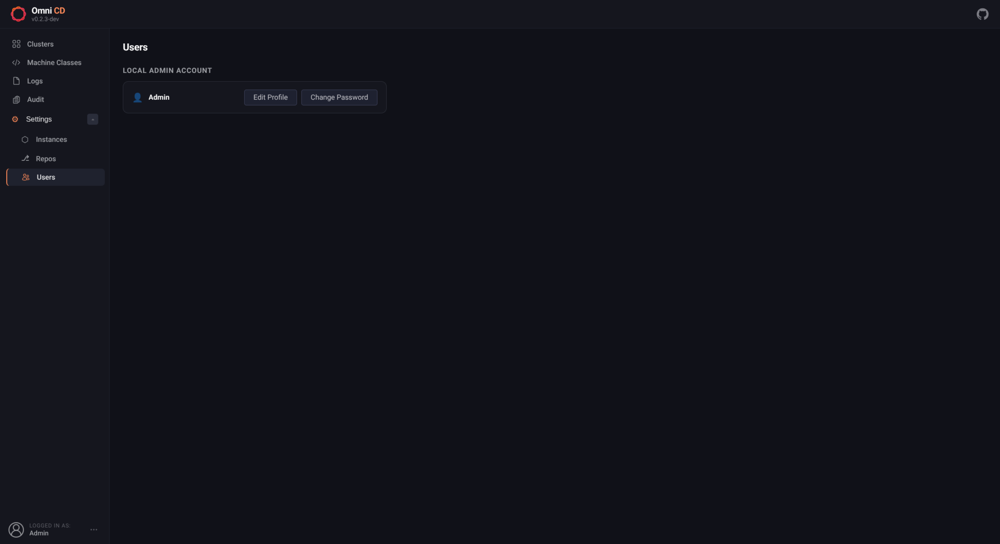
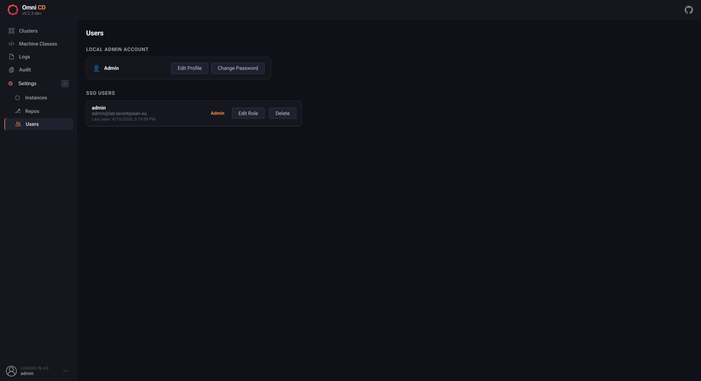
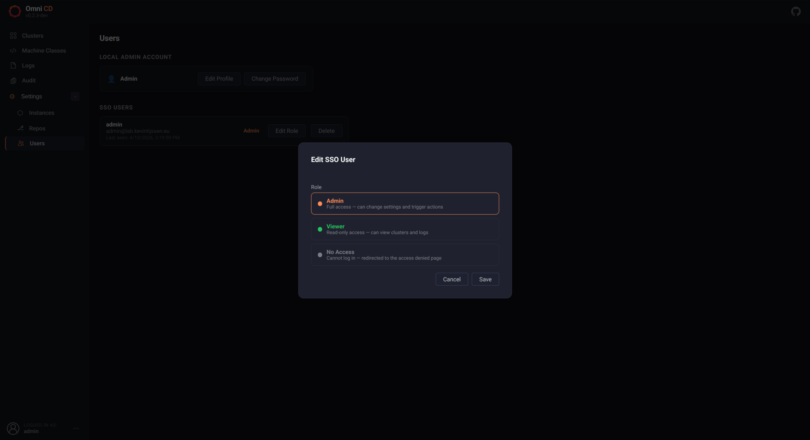
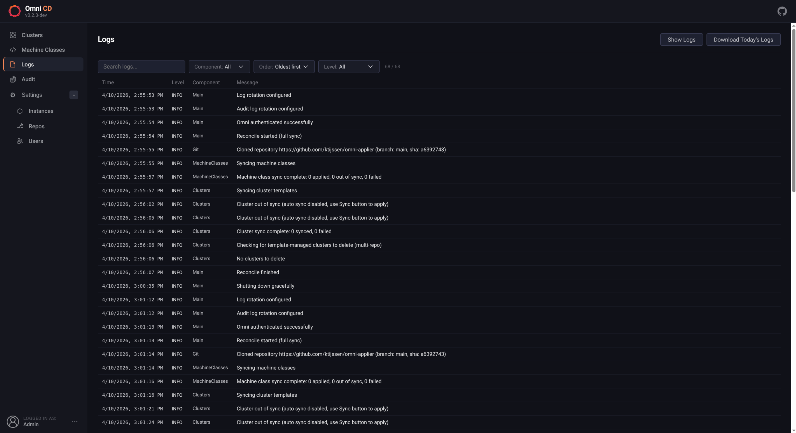
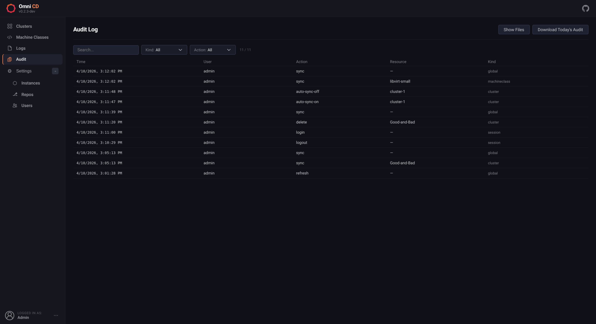

# Web UI

The UI is a single-page app with a collapsible sidebar. Navigating to `/` redirects to `/clusters`.

---

## Clusters (`/clusters`)

Card grid showing one card per cluster with:
- Talos and Kubernetes versions
- Cluster, controlplane, API, etcd, and WireGuard health badges
- Controlplane and worker pool configuration
- Per-cluster **Refresh**, **Sync**, **Auto-Sync** toggle, and **Delete** actions

The toolbar supports:
- **Status** — filter by sync status or cluster health
- **Sort** — by name or last sync time
- **Show** — page size (5, 10, 15, 20, or All)
- **Grid / List** layout toggle

Click a cluster card to open the detail page.

### Cluster Detail

Three tabs:

| Tab | Contents |
|---|---|
| **Graph** | Visual DAG: Git → Omni → Cluster → MachineSets → Machines |
| **Live** | Current resource YAML as seen by Omni |
| **Diff** | Colour-coded diff between desired (Git) and live state |

Clusters created outside of Git (unmanaged) show an **Export** button to download them as a YAML template.

---

## Machine Classes (`/machineclasses`)

Card grid showing each MachineClass with its provisioning mode, resource settings, machine limit, and a live **Used by** list of clusters referencing it.

Each card has **Refresh**, **Sync**, **Auto-Sync** toggle, and **Delete** actions. Click a cluster chip to jump directly to that cluster.

The toolbar supports the same Status, Sort, Show, and layout controls as the Clusters view.

---

## Instances (`/instances`)

Manage the Omni endpoint and service account key. When credentials are provided via environment variables they are shown as read-only. When not set via ENV, use **Add Omni Instance** to configure the connection, or **Edit** / **Delete** an existing one. Changes take effect immediately.

---

## Repos (`/repos`)

Add, edit, and remove Git repositories at runtime without restarting. Supports optional per-repo authentication tokens. Default paths are `clusters/` and `machine-classes/` if not specified.

---

## Users (`/users`)

### Local Admin Account

- **Edit Profile** — update the display name
- **Change Password** — change your password (requires current password; enforces strength rules)

### SSO Users

When OIDC or Auth0 is enabled, all users who have logged in via SSO are listed here with their assigned role. Admins can change each user's role (`admin`, `viewer`, or `none`) or remove them.

> This page is hidden and inaccessible when `AUTH_DISABLED=true`.

---

## Logs (`/logs`)

Reconciler log stream with filtering and export:

- **Level** — filter by ALL / DEBUG / INFO / WARN / ERROR
- **Component** — narrow to a specific component
- **Search** — filter by message content
- **Order** — oldest first (default) or newest first
- **Download Today's Logs** — download the current day's `.jsonlog` file
- **Show Logs** — browse all stored daily log files with individual download buttons

Logs are written to daily rotating `.jsonlog` files under `/data/logs/` and re-loaded on restart. Files older than `LOG_RETENTION_DAYS` days are deleted automatically.

---

## Audit Log (`/audit`)

Records every user-initiated action:

| Column | Description |
|---|---|
| Time | UTC timestamp |
| User | Username or email of the actor |
| Action | What was done (e.g. `login`, `sync`, `delete`, `repo-add`) |
| Resource | The affected resource name |
| Kind | Resource type (`cluster`, `machineclass`, `repo`, `user`, `session`) |

Filters: **Kind**, **Action**, and free-text **Search**. Download options identical to the Logs page.

Audit files are stored under `/data/audit/` and kept for `AUDIT_RETENTION_DAYS` days (default: 30).
